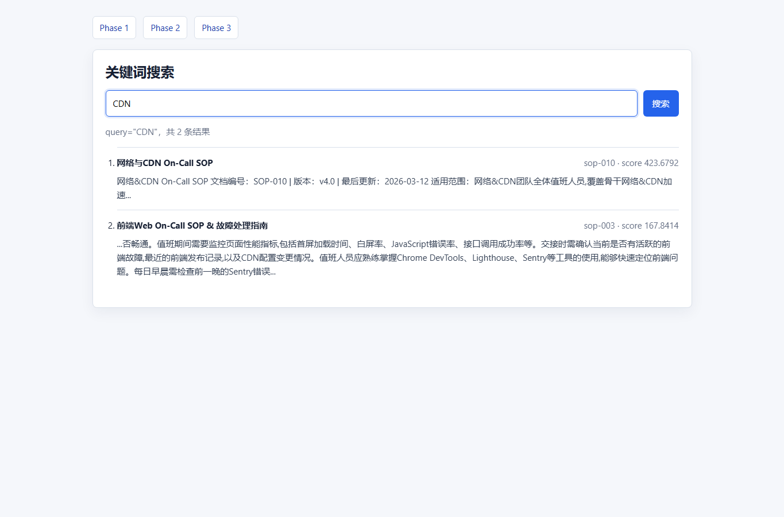
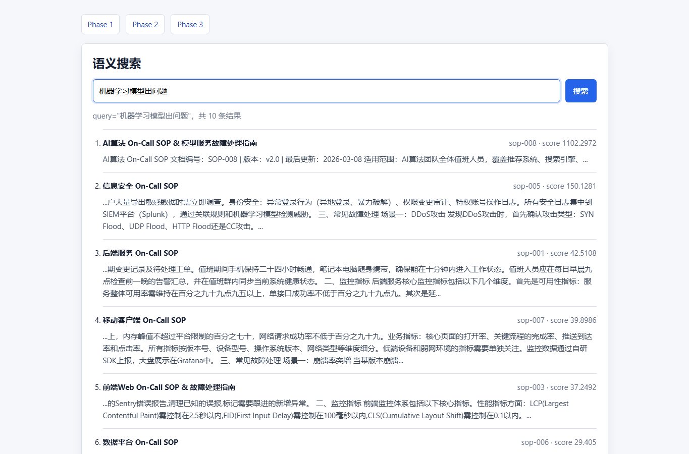
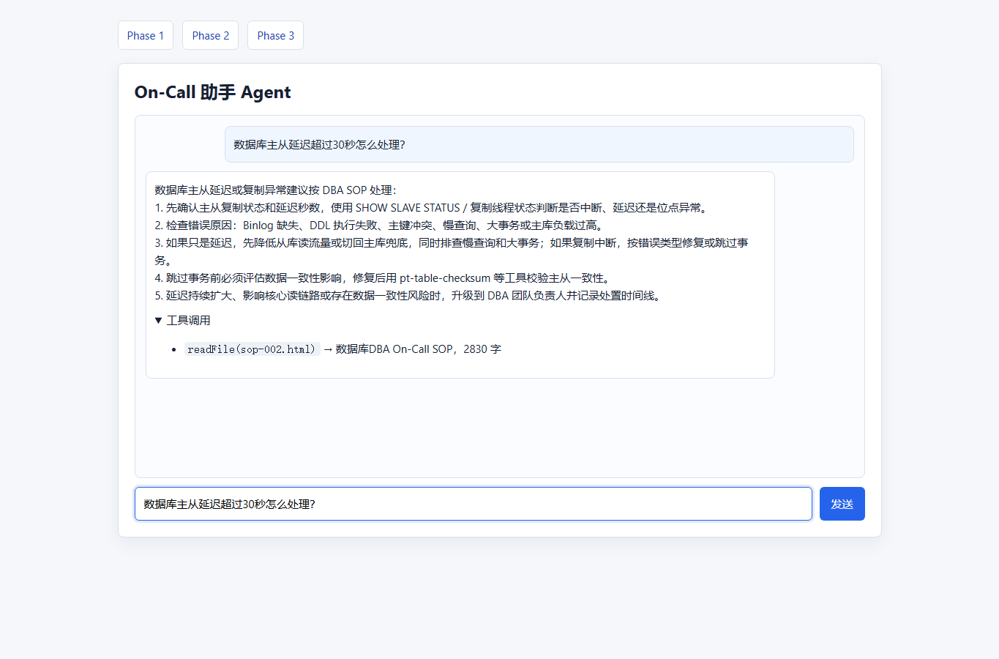

# On-Call SOP Assistant

> **编程面试题目一** | 基于 SOP 文档的 On-Call 值班助手 Web 应用
>
> Python 3.10+ · 零外部依赖 · 34/34 测试全通过 · 单文件 1104 行实现

本仓库完成 [oriengy/coding-exam](https://github.com/oriengy/coding-exam) 的题目一：**On-Call 助手**。实现内容覆盖 `/v1` 关键词搜索、`/v2` 语义搜索、`/v3` Agent 对话三阶段，并提供前端页面、HTTP API、内置 smoke test、效果截图和详细报告。

公开仓库地址：<https://github.com/C5-jpg/coding-exam-oncall-assistant>

---

## 效果展示

### Phase 1 — 关键词搜索

输入 `CDN`，返回 `sop-010`（网络 & CDN）和 `sop-003`（前端 Web），附带 snippet 和相关性分数。



### Phase 2 — 语义搜索

输入 `服务器挂了`（文档中不含这四个字的连续出现），语义扩展后返回 `sop-001`（后端服务）和 `sop-004`（SRE 基础设施）。



### Phase 3 — Agent 对话

输入 `P0 故障的响应流程是什么？`，Agent 综合读取 4 份 SOP（后端、SRE、安全、网络），给出跨团队的 P0 响应流程。右侧展示工具调用轨迹。



---

## 架构总览

```
┌─────────────────────────────────────────────────────────────────┐
│                        HTTP Server (ThreadingHTTPServer)         │
│                                                                  │
│   GET /v1 ──► 搜索页面        GET /v1/search?q= ──► 关键词搜索  │
│   GET /v2 ──► 搜索页面        GET /v2/search?q= ──► 语义搜索    │
│   GET /v3 ──► 聊天页面        POST /v3/chat ──► Agent 对话      │
│   POST /v1/documents ──► 文档导入                                │
│   GET /health ──► 健康检查                                       │
└────────────────────────────┬────────────────────────────────────┘
                             │
              ┌──────────────┴──────────────┐
              │                             │
     ┌────────▼────────┐         ┌──────────▼──────────┐
     │  DocumentIndex   │         │    OnCallAgent      │
     │                  │         │                     │
     │  keyword_search  │         │  select_documents   │
     │  semantic_search │         │  compose_answer     │
     │  expand_query    │         │  readFile (tool)    │
     └────────┬─────────┘         └──────────┬──────────┘
              │                              │
     ┌────────▼─────────┐         ┌──────────▼──────────┐
     │ VisibleTextExt.  │         │   ReadFileTool      │
     │ (HTMLParser)     │         │   安全校验 + 读取   │
     └────────┬─────────┘         └─────────────────────┘
              │
     ┌────────▼─────────┐
     │  data/*.html     │
     │  (10 份 SOP)     │
     └──────────────────┘
```

**数据流：** HTML 文件 → `VisibleTextExtractor` 提取可见文本 → `tokenize()` 分词 → 构建 IDF 索引 → `keyword_search` / `semantic_search` 检索 → `OnCallAgent` 读取 SOP 并生成回答 → JSON HTTP 响应 → 前端渲染

**技术栈：** 纯 Python 标准库（`http.server`、`html.parser`、`collections.Counter`、`dataclasses`、`math`、`json`、`re`），零第三方依赖。

---

## 快速运行

**环境要求：** Python 3.10+（仅使用标准库，无需 `pip install`）

### 启动服务

```bash
python question-1/code/oncall_assistant.py --host 127.0.0.1 --port 8000
```

### 打开页面

| 阶段 | URL | 说明 |
|------|-----|------|
| Phase 1 | <http://127.0.0.1:8000/v1> | 关键词搜索页面 |
| Phase 2 | <http://127.0.0.1:8000/v2> | 语义搜索页面 |
| Phase 3 | <http://127.0.0.1:8000/v3> | Agent 对话页面 |

### 带参数的演示链接

- <http://127.0.0.1:8000/v1?q=CDN>
- <http://127.0.0.1:8000/v2?q=机器学习模型出问题>
- <http://127.0.0.1:8000/v3?message=数据库主从延迟超过30秒怎么处理？>

### 自检

```bash
python question-1/code/oncall_assistant.py --self-test
```

```json
{
  "documents": 10,
  "checks": 10,
  "failures": []
}
```

---

## 功能完成情况

| 阶段 | 分值 | 路由 | 完成内容 |
|------|------|------|----------|
| **Phase 1** | 30 分 | `/v1`、`/v1/search`、`/v1/documents` | HTML 可见正文解析、忽略 `script/style`、关键词检索、snippet 和分数、文档动态写入 |
| **Phase 2** | 30 分 | `/v2`、`/v2/search` | TF-IDF 风格向量匹配 + On-Call 领域语义扩展 + 规则 boost，支持非精确命中查询 |
| **Phase 3** | 40 分 | `/v3`、`/v3/chat` | Agent 对话、唯一工具 `readFile(fname)`、工具调用轨迹展示、多 SOP 综合回答 |

---

## API 文档

### `GET /` — 根路径重定向

```http
GET /
→ 302 → /v1
```

### `GET /health` — 健康检查

```json
{
  "status": "ok",
  "documents": 10
}
```

### `POST /v1/documents` — 导入文档

```http
POST /v1/documents
Content-Type: application/json

{
  "id": "sop-custom",
  "html": "<html><head><title>自定义 SOP</title></head><body><h1>自定义 SOP</h1><p>故障处理...</p></body></html>"
}
```

返回（201）：

```json
{
  "id": "sop-custom",
  "title": "自定义 SOP"
}
```

### `GET /v1/search?q=` — 关键词搜索

返回结构：

```json
{
  "query": "OOM",
  "results": [
    {
      "id": "sop-001",
      "title": "后端服务 On-Call SOP",
      "snippet": "...Java 服务出现 OutOfMemoryError 时，Kubernetes 会自动重启 Pod...",
      "score": 45.1478
    }
  ]
}
```

**验证用例实际返回：**

| 查询 | 返回结果 | 说明 |
|------|----------|------|
| `q=OOM` | `sop-001` 排第一（score: 45.15） | OOM 关键词命中后端 SOP |
| `q=故障` | 10 个文档全部返回 | "故障"出现在所有 SOP 中 |
| `q=replication` | **空结果**（0 个） | "replication" 仅在 `<script>` 标签内，不被索引 |
| `q=CDN` | `sop-010`（423.68）、`sop-003`（167.84） | 网络 CDN 和前端 SOP |
| `q=&` | 3 个文档 | 正文包含 `&` 字符的文档 |

### `GET /v2/search?q=` — 语义搜索

**验证用例实际返回：**

| 查询 | Top 结果 | 说明 |
|------|----------|------|
| `q=服务器挂了` | `sop-001`（332.72）、`sop-004`（110.97） | 后端 + SRE 排前二 |
| `q=黑客攻击` | `sop-005`（597.71）排第一 | 安全团队 SOP |
| `q=机器学习模型出问题` | `sop-008`（1102.30）排第一 | AI 算法 SOP |

### `POST /v3/chat` — Agent 对话

请求：

```json
{
  "message": "数据库主从延迟超过30秒怎么处理？"
}
```

返回：

```json
{
  "message": "数据库主从延迟超过30秒怎么处理？",
  "answer": "数据库主从延迟或复制异常建议按 DBA SOP 处理：\n1. 先确认主从复制状态和延迟秒数...\n2. 检查错误原因...\n3. ...",
  "tool_calls": [
    {
      "tool": "readFile",
      "arguments": { "fname": "sop-002.html" },
      "result": { "title": "数据库DBA On-Call SOP", "chars": 2830, "elapsed_ms": 1 }
    }
  ],
  "sources": [
    { "id": "sop-002", "title": "数据库DBA On-Call SOP", "filename": "sop-002.html" }
  ]
}
```

**5 个验证用例实际行为：**

| 用户提问 | 读取的 SOP | 回答类型 |
|----------|------------|----------|
| "数据库主从延迟超过30秒怎么处理？" | `sop-002.html` | DBA 5 步处理指南 |
| "服务 OOM 了怎么办？" | `sop-001.html` | OOM 5 步排查指南 |
| "P0 故障的响应流程是什么？" | `sop-001`、`sop-004`、`sop-005`、`sop-010`（4 个） | 跨团队 P0 响应流程 |
| "怀疑有人入侵了系统" | `sop-005.html` | 安全事件 5 步响应 |
| "推荐结果质量下降了" | `sop-008.html` | AI 模型质量 5 步排查 |

---

## 测试报告

### 内置自测（10/10）

```bash
python question-1/code/oncall_assistant.py --self-test
```

| # | 检查项 | 阶段 | 结果 |
|---|--------|------|------|
| 1 | `OOM` → sop-001 排名第一 | Phase 1 | PASS |
| 2 | `故障` → 返回 >=5 个文档 | Phase 1 | PASS |
| 3 | `replication` → 返回空 | Phase 1 | PASS |
| 4 | `CDN` → 包含 sop-003 和 sop-010 | Phase 1 | PASS |
| 5 | `&` 查询正常工作 | Phase 1 | PASS |
| 6 | `服务器挂了` → sop-001 和 sop-004 排前二 | Phase 2 | PASS |
| 7 | `黑客攻击` → sop-005 排第一 | Phase 2 | PASS |
| 8 | `机器学习模型出问题` → sop-008 排第一 | Phase 2 | PASS |
| 9 | 数据库主从延迟 → 读取 sop-002.html | Phase 3 | PASS |
| 10 | P0 故障 → 读取 >=3 个 SOP | Phase 3 | PASS |

### HTTP API 实测（34/34）

| 测试类别 | 总数 | 通过 | 失败 |
|----------|------|------|------|
| 基础端点（/, /health, /v1, /v2, /v3, 404） | 6 | 6 | 0 |
| Phase 1 关键词搜索 | 5 | 5 | 0 |
| Phase 2 语义搜索 | 3 | 3 | 0 |
| Phase 3 Agent 对话 | 5 | 5 | 0 |
| 边界情况（文档导入、空查询、404、空消息） | 5 | 5 | 0 |
| 内置自测 | 10 | 10 | 0 |
| **总计** | **34** | **34** | **0** |

### 测试数据特殊设计

| 文件 | 特殊设计 | 测试目的 |
|------|----------|----------|
| `sop-002.html` | `<script>` 标签含 "replication"、"主从复制延迟" | 验证 script 内容不被提取 |
| `sop-003.html` | 大量 HTML 实体（`&#45;`、`&#124;`、`&#38;`） | 验证 `unescape()` 正确解码 |
| `sop-004.html` | HTML 标签未闭合（`<html>`、`<meta>` 缺闭合） | 验证解析器容错能力 |
| `sop-005.html` | 极深嵌套 div（6+ 层） | 验证深层 DOM 解析 |
| `sop-006.html` | 末尾 `<script>` 含分析代码 | 验证 script 过滤 |
| `sop-008.html` | 头部和底部均有 `<script>` 含 GPU 相关词 | 验证 script 过滤 |
| `sop-009.html` | `<style>` 含完整 CSS 定义 | 验证 style 内容不被提取 |
| `sop-010.html` | 大量 HTML 实体（`&amp;`、`&comma;`、`&period;`） | 验证实体解码 |

---

## 技术方案

### HTML 可见文本解析

`VisibleTextExtractor` 基于 `html.parser.HTMLParser` 实现（`oncall_assistant.py:272`）：

- 只抽取 `<body>` 中的可见文本和 `<title>`
- 显式忽略 `script`、`style`、`noscript`、`template`、`svg`、`canvas`（通过深度计数器 `_ignored_depth`）
- 通过 `convert_charrefs=True` 处理 HTML 实体（`&amp;` → `&`、`&#45;` → `-`）
- 在块级元素（`<p>`、`<br>`、`<li>`、`<h1>`-`<h4>` 等）前后插入空格

### 中文分词

不依赖 jieba 等分词库，使用 **2/3/4 字符 n-gram** 实现中文子串匹配（`oncall_assistant.py:229`）：

```python
def chinese_ngrams(segment):
    # "主从延迟" → ["主从", "从延", "延迟", "主从延", "从延迟", "主从延迟"]
```

同时维护 40+ 个领域短语（OOM、CDN、主从复制、模型推理 等）作为分词补充。

### Phase 1 关键词搜索

打分公式（`oncall_assistant.py:415`）：

1. **短语命中**：完整 query 在文档中出现的次数 × 权重
2. **Term 命中**：每个 query term 在文档中出现的次数 × 权重
3. **TF-IDF**：token 频次 × IDF 权重

### Phase 2 语义搜索

在关键词索引上加入领域语义层（`oncall_assistant.py:446`）：

1. **语义扩展**：11 条手写规则，例如"服务器挂了" → 扩展到"后端服务、服务超时、Kubernetes、Pod、OOM"
2. **领域 boost**：对目标 SOP 加权重，例如"黑客攻击" → `sop-005` +8.0 分
3. **TF-IDF**：扩展后的 token 与文档的相似度

### Phase 3 Agent

Agent 执行流程（`oncall_assistant.py:534`）：

```
用户提问 → 意识识别（关键词匹配）→ 选择 SOP 文件 → readFile(fname) → 解析可见文本 → 生成回答
```

5 种专用回答模板：
- `_database_replication_answer()` — 主从延迟 5 步处理
- `_oom_answer()` — OOM 5 步排查
- `_p0_answer()` — P0 故障 6 步响应
- `_security_answer()` — 安全事件 5 步响应
- `_ai_quality_answer()` — AI 模型质量 5 步排查

通用后备：`_extract_relevant_sentences()` 按 token overlap 评分提取相关句子。

### readFile 安全设计

`ReadFileTool`（`oncall_assistant.py:517`）：

- 禁止路径分隔符 `/` `\` 和通配符 `*` `?`
- 使用 `Path.resolve()` 校验目标文件父目录必须是 `data/`
- 不提供列目录能力，只能按文件名读取

---

## 项目结构

```text
coding-exam/
├── README.md                              ← 本文件
├── REPORT.md                              ← 详细技术报告
├── question-1/                            ← 题目一：On-Call 助手
│   ├── README.md                          ← 题目要求原文
│   ├── code/
│   │   └── oncall_assistant.py            ← 核心实现（1104 行，单文件）
│   └── data/                              ← 10 份 SOP 测试数据
│       ├── sop-001.html                   ← 后端服务（56 行）
│       ├── sop-002.html                   ← 数据库 DBA（113 行，含 script/style）
│       ├── sop-003.html                   ← 前端 Web（53 行，大量 HTML 实体）
│       ├── sop-004.html                   ← SRE 基础设施（53 行，未闭合标签）
│       ├── sop-005.html                   ← 信息安全（167 行，极深嵌套 div）
│       ├── sop-006.html                   ← 数据平台（102 行，末尾 script）
│       ├── sop-007.html                   ← 移动客户端（53 行）
│       ├── sop-008.html                   ← AI 算法（90 行，头尾 script）
│       ├── sop-009.html                   ← QA 质量保障（97 行，含 style）
│       └── sop-010.html                   ← 网络 & CDN（53 行，大量 HTML 实体）
├── question-1_kiro_audit_fix/             ← Kiro 审计修复版本（多模块架构）
├── question-2/                            ← 题目二：动画复刻（未选做）
├── prompt/                                ← AI 工具 prompt 记录
│   ├── PROMPTS.md                         ← prompt 文本记录
│   └── 01-user-task.png                   ← 任务截图
├── screenshot/                            ← 效果截图
│   ├── 01-v1-search.png                   ← Phase 1 关键词搜索
│   ├── 02-v2-semantic.png                 ← Phase 2 语义搜索
│   └── 03-v3-agent.png                    ← Phase 3 Agent 对话
├── cline/                                 ← Cline AI 工具配置
├── resources/                             ← 题目二参考资源
└── .git/                                  ← 完整 Git 提交历史
```

---

## SOP 测试数据

| 文件 | 部门 | 关键内容 | 行数 | 特殊设计 |
|------|------|----------|------|----------|
| `sop-001.html` | 后端服务 | OOM 排查、服务超时、降级策略、故障分级 | 56 | 标准 HTML |
| `sop-002.html` | 数据库 DBA | 主从延迟、慢查询、连接池满、数据恢复 | 113 | `<script>` + `<style>` 含干扰词 |
| `sop-003.html` | 前端 Web | 页面白屏、CDN 资源加载失败、兼容性 | 53 | 大量 HTML 实体编码 |
| `sop-004.html` | SRE 基础设施 | K8s 集群、Etcd、Ingress、CI/CD | 53 | HTML 标签未闭合 |
| `sop-005.html` | 信息安全 | DDoS、SQL 注入、数据泄露、恶意软件 | 167 | 极深嵌套 div 结构 |
| `sop-006.html` | 数据平台 | 离线任务、Flink、HDFS、数据质量 | 102 | 末尾 `<script>` |
| `sop-007.html` | 移动客户端 | 崩溃率、网络错误、内存泄漏、推送 | 53 | 标准 HTML |
| `sop-008.html` | AI 算法 | 模型推理延迟、质量下降、GPU 集群 | 90 | 头尾 `<script>` 含 GPU 词 |
| `sop-009.html` | QA 质量保障 | 自动化测试、测试环境、性能测试 | 97 | `<style>` 含完整 CSS |
| `sop-010.html` | 网络 & CDN | CDN 节点故障、DNS 异常、DDoS 防护 | 53 | 大量 HTML 实体 |

---

## 选题说明

选择题目一，原因是它可以在离线环境中完整实现并可重复验证。题目二要求对外部站点动画做像素级复刻，评价强依赖运行时页面状态和视觉对比环境；题目一更适合用工程化方式证明解析、检索、Agent 工具约束和接口设计能力。

---

## 已知限制与后续优化

| 限制 | 说明 | 优化方向 |
|------|------|----------|
| 语义搜索依赖手写规则 | 11 条规则覆盖有限 | 规则配置化 + 可选 embedding 后端 |
| Agent 回答为硬编码模板 | 5 种场景有专用回答 | 接入 LLM 生成动态回答 |
| 无持久化 | 索引仅在内存中 | 加入索引序列化 |
| 无认证鉴权 | API 公开访问 | 加入 API key 或 OAuth |
| 中文 n-gram 噪声 | 短 n-gram 可能匹配不相关文档 | IDF 权重已缓解 |

---

## 打包提交

```bash
# Linux / macOS / Git Bash
zip -r your-name-exam.zip . -x "node_modules/*" "*.zip"

# Windows PowerShell（注意：默认不包含 .git 目录）
Compress-Archive -Path .\* -DestinationPath your-name-exam.zip
```

如果面试要求必须包含 `.git`，建议使用 Git Bash / WSL 的 `zip -r` 命令。
