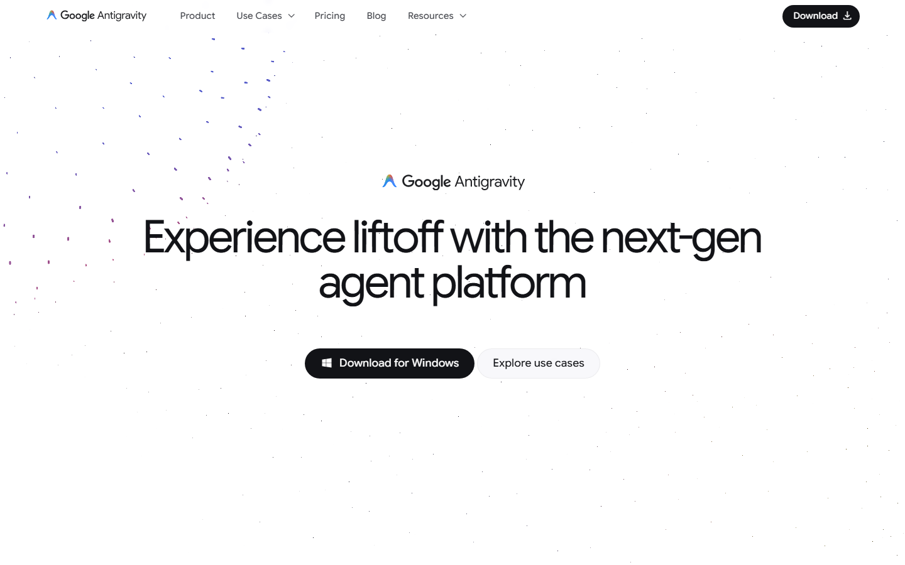
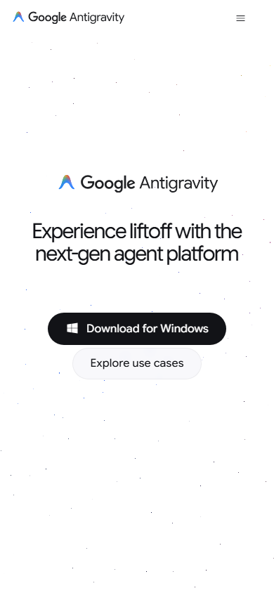
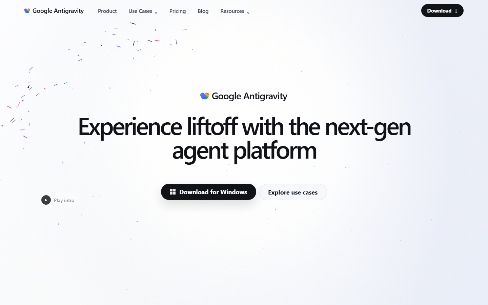
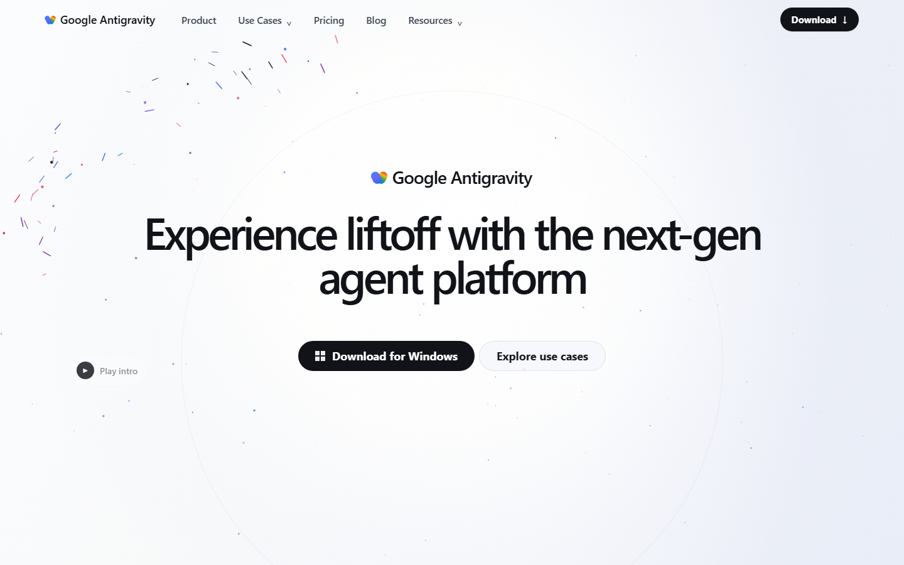
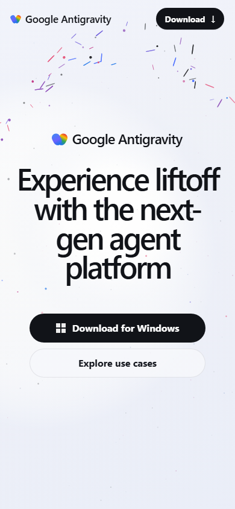

# Antigravity Animation Recreation

> 复刻对象：<https://antigravity.google/>  
> 实现范围：首屏布局、亮底粒子场、左侧半椭圆轨道粒子、CTA 区域、鼠标交互、点击波纹、移动端响应式、截图自检和像素差异辅助工具。


## 1. 项目概述

本项目完成 coding-exam 的 question-2：复刻 `antigravity.google` 首屏粒子动画体验。目标不是做普通粒子背景，而是围绕目标站首屏的视觉语言做一个可运行、可解释、可调参的 motion recreation。

### 1.1 技术栈

| 类别 | 选择 | 说明 |
| --- | --- | --- |
| 工程框架 | Vite | 轻量、启动快、构建结果干净 |
| 语言 | TypeScript | 粒子状态、配置和渲染参数都需要明确类型 |
| 渲染 | Canvas 2D | 目标页面是平面亮底粒子 + DOM hero，Canvas 2D 比 Three.js 更直接、更低依赖 |
| 动画循环 | `requestAnimationFrame` | 使用 `deltaTime` 归一化速度，避免高刷新率设备上运动变快 |
| 交互 | Pointer Events | 支持 mouse、touch、pen，并统一 hover/click 行为 |
| 自检 | Playwright screenshot + PNG diff script | 生成 reference/local 截图，并输出 RMSE/mismatch ratio |

### 1.2 实现亮点

- 全屏 Canvas，按 `devicePixelRatio` 缩放，最高 cap 到 2，避免高分屏模糊和过高像素成本。
- 三层粒子：全局 dust、左侧 orbit、中心 signal，每层有不同半径、透明度、阻尼、弹簧和交互权重。
- 轨道粒子不是随机星空，而是沿左侧半椭圆弧线布点，模拟目标站左侧彩色短划粒子群。
- 粒子有速度驱动形变：速度越大，椭圆/胶囊越拉伸，并按速度方向旋转。
- 鼠标移动会产生局部排斥 + 轻微旋涡，hover CTA 时交互半径和粒子响应增强。
- 点击产生扩散波纹，影响粒子加速度、透明度和缩放。
- 支持 `prefers-reduced-motion`，系统偏好减少动态时降低粒子数量和漂移幅度。
- README 中保留 reference/local 截图、误差分析和调参说明，方便面试官快速判断工程质量。

## 2. 目录结构

```text
question-2/
├── code/
│   ├── package.json
│   ├── package-lock.json
│   ├── tsconfig.json
│   ├── index.html
│   ├── scripts/
│   │   └── compare-screenshot.mjs
│   └── src/
│       ├── main.ts
│       ├── style.css
│       ├── particles/
│       │   ├── config.ts
│       │   ├── Particle.ts
│       │   ├── ParticleSystem.ts
│       │   ├── pointer.ts
│       │   └── Renderer.ts
│       └── utils/
│           ├── math.ts
│           └── random.ts
├── prompt/
│   ├── README.md
│   ├── 01-initial-prompt.html
│   └── 01-initial-prompt.png
├── screenshot/
│   ├── reference-desktop-1440.png
│   ├── reference-desktop-1920.png
│   ├── reference-mobile-390.png
│   ├── 01-overview-desktop.png
│   ├── 02-interaction-hover.png
│   ├── 03-click-ripple.png
│   └── 04-mobile.png
└── README.md
```

### 2.1 关键文件说明

| 文件 | 作用 |
| --- | --- |
| `src/main.ts` | 应用入口，启动粒子系统，处理 debug/capture URL 参数 |
| `src/style.css` | 顶部导航、hero、按钮、移动端响应式和 capture hover 样式 |
| `particles/config.ts` | 粒子数量、半径、透明度、阻尼、弹簧、交互半径等集中配置 |
| `particles/Particle.ts` | 单个粒子的状态、轨道目标、力学更新、形变参数 |
| `particles/ParticleSystem.ts` | RAF 主循环、resize、reduced-motion、FPS debug |
| `particles/Renderer.ts` | Canvas 尺寸管理、背景渐变、粒子绘制、点击波纹绘制 |
| `particles/pointer.ts` | pointermove、pointerleave、pointerdown、hover、scroll 状态 |
| `scripts/compare-screenshot.mjs` | 纯 Node PNG 解码和截图差异计算工具，无第三方运行依赖 |

## 3. 快速运行

```bash
cd question-2/code
npm install
npm run dev
npm run build
npm run preview
```

默认开发地址：

```text
http://127.0.0.1:5173/
```

调试 FPS 与粒子数量：

```text
http://127.0.0.1:5173/?debug=1
```

性能/画质档位：

```text
http://127.0.0.1:5173/?debug=1&quality=low
http://127.0.0.1:5173/?debug=1&quality=balanced
http://127.0.0.1:5173/?debug=1&quality=high
```

默认档位是 `balanced`，用于规避浏览器在 Intel 核显或低功耗 ANGLE 后端上卡顿。`high` 档保留完整粒子数量和最高 DPR，建议只在确认 Chrome/Edge 已经运行在 NVIDIA/AMD 独显上时使用。

用于截图的 deterministic capture 模式：

```text
http://127.0.0.1:5173/?capture=hover
http://127.0.0.1:5173/?capture=click
```

### 3.1 独显测试建议

如果机器同时有 Intel 核显和 NVIDIA/AMD 独显，应先把浏览器固定到高性能 GPU，否则 Canvas/WebGL 页面可能由核显承担，出现占用高、帧率波动和明显卡顿。

Windows 推荐设置：

1. 打开 `设置 -> 系统 -> 显示 -> 图形`。
2. 添加或选择 `C:\Program Files\Google\Chrome\Application\chrome.exe`。
3. 点击 `选项`，选择 `高性能`，保存。
4. 如果使用 Edge，同样设置 `C:\Program Files (x86)\Microsoft\Edge\Application\msedge.exe`。
5. 完全退出浏览器后重新打开页面。

也可以用 PowerShell 设置当前用户的图形偏好：

```powershell
$pref='HKCU:\Software\Microsoft\DirectX\UserGpuPreferences'
New-Item -Path $pref -Force | Out-Null
New-ItemProperty -Path $pref -Name 'C:\Program Files\Google\Chrome\Application\chrome.exe' -PropertyType String -Value 'GpuPreference=2;' -Force
New-ItemProperty -Path $pref -Name 'C:\Program Files (x86)\Microsoft\Edge\Application\msedge.exe' -PropertyType String -Value 'GpuPreference=2;' -Force
```

重启浏览器后，用以下命令观察 NVIDIA 是否有浏览器进程或显存占用：

```powershell
nvidia-smi
```

注意：部分 Windows WDDM/Optimus 环境下，`nvidia-smi` 不一定显示所有图形进程。最终还应在 `chrome://gpu` 或 Windows 任务管理器的 GPU Engine 列确认浏览器是否使用 `GPU 1 - 3D` 等独显引擎。

## 4. 目标页面观察

以下观察基于 2026-05-14 打开的 `https://antigravity.google/`，并保存了 reference 截图。

### 4.1 Reference 截图

| 桌面 1440x900 | 移动 390x844 |
| --- | --- |
|  |  |

### 4.2 首屏布局

- 背景是接近白色的亮底，不是深色科技星空。主色约为 `#fbfbfa` 到 `#ffffff`，右侧有极淡冷灰蓝渐变。
- 顶部导航固定在首屏顶部区域，左侧是 Google Antigravity 品牌，右侧是黑色 Download pill。
- Hero 居中，品牌 kicker 在标题上方，主标题两行排版，字重较轻但视觉体量很大。
- 主 CTA 是黑底圆角 pill，次 CTA 是浅灰边框 pill。
- 粒子不抢主视觉，更多像页面背后的 motion layer。核心粒子集中在左侧半椭圆轨道，右侧和底部只有稀疏微点。

### 4.3 粒子形态

- 大多数粒子非常小，表现为 1px 左右的点。
- 左侧轨道粒子包含短划、胶囊、微型椭圆，颜色主要是蓝、紫、粉红、少量黑/灰。
- 粒子没有强光晕，也没有大面积模糊；整体克制、干净、稀疏。
- 左侧轨道形成一个大半径椭圆弧，像从左下向左上再到上方收束的粒子带。

### 4.4 动画行为

- 基础运动很慢，主要是轻微漂浮、旋转和沿轨道的微小相位偏移。
- 彩色短划粒子有轻微方向变化，不是静态横线。
- 粒子密度随区域变化：左侧轨道密度高，中心文字区域保持干净，右侧只有少量远景点。
- 运动随机性低于普通星空粒子，更像被设计过的 UI motion。

### 4.5 交互行为

- 鼠标靠近粒子时应即时产生局部扰动，而不是整屏大幅爆炸。
- CTA hover 时 motion 应略微增强，但不要压过按钮本身。
- 点击应产生短暂冲击波或局部散开，然后粒子通过弹簧和阻尼回归。
- resize 时粒子应按新视口重新分布，避免 Canvas 模糊或坐标漂移。

### 4.6 复刻策略

| 目标特征 | 实现策略 |
| --- | --- |
| 亮底、低对比背景 | Canvas 每帧绘制白色到冷灰蓝的极淡渐变 |
| 左侧半椭圆粒子带 | `orbit` layer 按椭圆弧角度生成 base position |
| 稀疏远景微点 | `dust` layer 全屏低透明点，使用 muted palette |
| 彩色短划形变 | `Particle.getDrawState()` 根据速度设置 `scaleX/scaleY/rotation` |
| 自然回归 | spring force + damping |
| 鼠标扰动 | pointer radius 内排斥 + 垂直旋涡力 |
| 点击波纹 | ripple age 推进半径，带状影响粒子位置和透明度 |
| 移动端适配 | 重新计算轨道中心、半径、hero 字号和按钮布局 |

## 5. 粒子系统设计

### 5.1 数据结构

每个粒子包含以下状态：

```ts
baseX/baseY          // 原始基准位置
x/y                  // 当前绘制位置
vx/vy                // 当前速度
ax/ay                // 当前加速度
radius/scale         // 半径和缩放
opacity              // 透明度
color                // 粒子颜色
angularVelocity      // 自旋速度
rotation             // 当前旋转角
phase/noiseSeed      // 噪声相位
targetX/targetY      // 当前弹簧目标位置
interactionWeight    // 鼠标交互权重
lifetime/loopProgress
```

### 5.2 三层粒子

| Layer | 数量 | 视觉职责 | 运动特征 |
| --- | ---: | --- | --- |
| `dust` | high: 118 / balanced: 93 / low: 62 | 全屏极低透明微点 | 慢漂浮、低交互权重 |
| `orbit` | high: 68 / balanced: 54 / low: 36 | 左侧彩色半椭圆短划 | 轨道相位偏移、形变明显 |
| `signal` | high: 28 / balanced: 22 / low: 15 | 中景信号点 | 比 dust 更亮、漂移更明显 |

### 5.3 浏览器性能约束与优化

最初版本在 Canvas 2D 中每帧重新创建 3 个全屏渐变并填充整屏，在核显上会造成不必要的 GPU/CPU 压力。当前版本做了以下优化：

- 背景渐变缓存到离屏 canvas，仅在 resize 时重绘。
- 默认 `balanced` 档将 DPR cap 降到 1.5，避免高分屏下每帧处理过多像素。
- 粒子数量按 `quality` 档位缩放。
- `shadowBlur` 按档位缩放，`balanced` 默认只保留少量柔化。
- 保留 `low` 档用于核显、远程桌面或录屏环境。

### 5.4 物理模型

核心更新逻辑：

```text
target = base/orbit position + procedural drift
acceleration += (target - current) * spring
acceleration += pointer repulsion + swirl
acceleration += ripple impulse
velocity += acceleration * dt
velocity *= damping
position += velocity * dt
```

这样做的好处是：粒子被鼠标和点击扰动后不会瞬移，也不会无边界漂走，而是带着阻尼缓慢回到设计好的构图位置。

### 5.5 形变绘制

绘制时不会只画圆点：

- `orbit` 粒子大多绘制成胶囊短划。
- 速度越大，`scaleX` 越大，`scaleY` 略微压缩。
- 绘制旋转角取速度方向，因此扰动时会出现顺着运动方向的拉伸。
- 点击波纹会让局部粒子短暂增大、变亮、再恢复。

## 6. 页面结构与 UI 复刻



页面不是裸 Canvas，而是完整首屏：

- `site-header`：品牌、导航、Download pill。
- `hero`：品牌 kicker、两行主标题、主/次 CTA。
- `video-orbit`：左侧轻量 Play intro 入口，用来贴近目标 DOM 中的 play intro 元素。
- `below-fold`：给页面提供可滚动内容，便于测试 scroll/parallax。

排版上使用接近 Google 风格的系统字体栈，标题使用大字号、轻字重、紧 letter-spacing。按钮保持 pill 形状，黑底主 CTA 与浅灰次 CTA 对比。

## 7. 交互说明

### 7.1 Pointer Move

鼠标进入页面后，粒子系统记录 pointer 平滑坐标。粒子在 pointer 半径内受到两种力：

- 径向排斥：让粒子从鼠标附近让开。
- 切向 swirl：让运动更像流体扰动，而不是机械直线排开。

### 7.2 Hover

所有带 `data-interactive` 的 DOM 元素会影响 `PointerState.isHovering`。hover 时：

- pointer 作用半径扩大。
- 粒子交互强度提高。
- CTA 自身有轻微 lift 和阴影。

### 7.3 Click Ripple



点击会创建一个 ripple：

```ts
{
  x,
  y,
  age,
  strength
}
```

ripple 半径随时间扩散，只有靠近波前 band 的粒子会被推动，因此画面会出现一圈短暂波纹，而不是整屏粒子同时跳动。

### 7.4 Reduced Motion

如果系统开启 `prefers-reduced-motion: reduce`：

- 粒子数量降到约 38%。
- drift 幅度降低。
- CSS hover transition 关闭。

## 8. 截图与自检

### 8.1 本地效果截图

| 桌面总览 | Hover 交互 |
| --- | --- |
|  |  |

| 点击波纹 | 移动端 |
| --- | --- |
|  |  |

### 8.2 生成截图命令

```bash
cd question-2/code
npm run dev -- --port 5173
```

```bash
playwright screenshot --wait-for-timeout 2000 --viewport-size "1440,900" "http://127.0.0.1:5173/" ../screenshot/01-overview-desktop.png
playwright screenshot --wait-for-timeout 2200 --viewport-size "1440,900" "http://127.0.0.1:5173/?capture=hover" ../screenshot/02-interaction-hover.png
playwright screenshot --wait-for-timeout 1100 --viewport-size "1440,900" "http://127.0.0.1:5173/?capture=click" ../screenshot/03-click-ripple.png
playwright screenshot --wait-for-timeout 2000 --viewport-size "390,844" "http://127.0.0.1:5173/" ../screenshot/04-mobile.png
```

### 8.3 Reference 截图命令

```bash
playwright screenshot --wait-for-timeout 3500 --viewport-size "1440,900" "https://antigravity.google/" question-2/screenshot/reference-desktop-1440.png
playwright screenshot --wait-for-timeout 3500 --viewport-size "1920,1080" "https://antigravity.google/" question-2/screenshot/reference-desktop-1920.png
playwright screenshot --wait-for-timeout 3500 --viewport-size "390,844" "https://antigravity.google/" question-2/screenshot/reference-mobile-390.png
```

## 9. 视觉对比与误差分析

### 9.1 背景色

- Reference：首屏白底为主，轻微冷灰蓝渐变，文字区域几乎纯白。
- Local：使用 `#ffffff -> #fbfbfa -> #f4f6fb` 渐变，并叠加中心白色 halo。
- 误差：右侧冷色渐变可能略明显，但在截图中能增强远景层次。

### 9.2 粒子密度

- Reference：左侧轨道粒子稀疏，右侧有极少量微点。
- Local：左侧轨道密度和颜色层次接近，但局部短划数量仍略高。
- 调整策略：`config.ts` 中 `orbit.count`、`dust.count`、`opacity` 均可直接调低。

### 9.3 运动速度

- Reference：运动极慢，以漂浮和轻微旋转为主。
- Local：`speed` 区间控制在 `0.03-0.19`，并用 deltaTime 保持不同设备上的速度一致。
- 误差：无法直接采集目标站内部动画参数，因此速度使用视觉观察近似。

### 9.4 鼠标交互

- Reference：目标站交互较克制，没有大面积爆炸。
- Local：pointer radius 约 230px，hover 后扩大；粒子被扰动后通过弹簧回归。
- 误差：实际站点可能只对部分粒子响应，本实现对三层粒子都有响应，但权重不同。

### 9.5 形变效果

- Reference：彩色短划粒子会有方向和长度变化。
- Local：速度越快，胶囊粒子 `scaleX` 越长，`scaleY` 略压缩，并按速度方向旋转。
- 误差：Canvas 2D 形变是椭圆/胶囊近似，不是目标站可能使用的 SVG/WebGL primitive。

### 9.6 已知差异

1. Logo mark 为 CSS 近似绘制，不直接复制目标站资源。
2. 文案只保留短语级视觉占位，未复制完整站点内容。
3. 粒子轨迹基于观察和手工调参，不读取或复用目标站专有源码。
4. 因目标页面粒子是实时动画，静态截图 diff 只能作为辅助指标，不代表运动完全一致。

## 10. Screenshot Diff 工具

`scripts/compare-screenshot.mjs` 是纯 Node PNG diff 工具，支持 8-bit RGB/RGBA PNG。它输出：

- `meanAbsolute`：平均绝对色差。
- `rmse`：均方根误差。
- `mismatchRatio`：超过阈值的像素占比。

使用方式：

```bash
cd question-2/code
npm run compare -- ../screenshot/reference-desktop-1440.png ../screenshot/01-overview-desktop.png 24
```

示例输出格式：

```json
{
  "width": 1440,
  "height": 900,
  "threshold": 24,
  "meanAbsolute": 13.5057,
  "rmse": 40.3763,
  "mismatchRatio": 0.043795
}
```

这是当前 `reference-desktop-1440.png` 与 `01-overview-desktop.png` 的一次实际结果。该工具的价值不是追求 0 差异，而是让视觉调参可以量化，尤其适合比较背景色、排版位置和粒子密度变化。

## 11. 工程质量验证

已执行：

```bash
cd question-2/code
npm install
npm run build
```

构建结果：

```text
✓ 11 modules transformed
✓ built in ~300ms
```

包体积：

```text
index.html           ~2.86 kB
assets/*.css         ~5.65 kB
assets/*.js          ~14.40 kB
```

### 11.1 Console 检查

实现中没有业务 `console.log`。如需运行时状态，请使用：

```text
http://127.0.0.1:5173/?debug=1
```

右下角会显示 FPS、粒子数量、reduced-motion 状态。

## 12. 可调参数

核心参数集中在 `src/particles/config.ts`：

```ts
qualityProfiles      // low / balanced / high 画质性能档
pointer.radius       // 鼠标影响半径
pointer.force        // 鼠标扰动力
pointer.swirl        // 切向旋涡强度
ripple.duration      // 点击波纹生命周期
ripple.radius        // 点击波纹最大半径
layers[].count       // 各层粒子数量
layers[].spring      // 回归弹簧
layers[].damping     // 阻尼
layers[].drift       // 基础漂移幅度
```

椭圆轨道位置在 `Particle.assignOrbitPosition()` 中，根据桌面/移动端视口分别计算。

## 13. Commit 建议

本轮未自动提交。建议后续按阶段提交：

```bash
git add question-2
git commit -m "Implement antigravity animation recreation"
```

如果继续调参，可再单独提交：

```bash
git add question-2
git commit -m "Tune antigravity particle motion and documentation"
```

## 14. 总结

本实现以 Canvas 2D 构建了一个可解释的 motion system：粒子并非随机铺满，而是按目标页面构图拆成左侧轨道、远景微点和中景信号层；交互通过物理力学完成，点击和 hover 都能看到即时但克制的响应。虽然无法在不复用目标站源码的前提下保证绝对像素级一致，但项目给出了可运行实现、reference/local 截图、误差分析和 diff 工具，体现了尽可能高保真复刻的工程过程。
